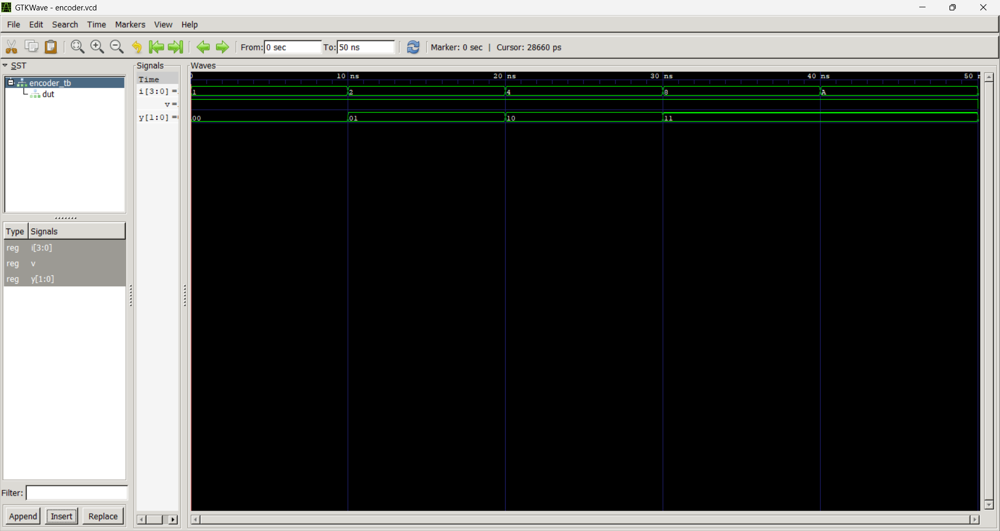

# 🧪 Lab 3: VHDL Code for Combinational Circuits (Encoder and Decoder)

## 🎯 Objective
- To design and simulate a **4-to-2 priority encoder** in VHDL.  
- To design and simulate a **2-to-4 decoder** in VHDL.  

---

## 📖 Theory

### 🔹 Encoder
An **encoder** converts \(2^n\) input lines into an \(n\)-bit binary code.  
- Only one input is active (HIGH) at a time.  
- A **4-to-2 encoder** has 4 inputs (I0–I3) and produces a 2-bit output (Y1Y0).  
- A **priority encoder** resolves conflicts when multiple inputs are active by giving priority to the highest-numbered input.  

**Truth Table (Priority Encoder 4-to-2):**

| I3 | I2 | I1 | I0 | Y1 | Y0 |
|----|----|----|----|----|----|
| 0  | 0  | 0  | 1  | 0  | 0  |
| 0  | 0  | 1  | X  | 0  | 1  |
| 0  | 1  | X  | X  | 1  | 0  |
| 1  | X  | X  | X  | 1  | 1  |

---

### 🔹 Decoder
A **decoder** converts an \(n\)-bit binary input into one of \(2^n\) output lines.  
- A **2-to-4 decoder** has a 2-bit input (A1A0) and 4 outputs (Y0–Y3).  
- Exactly one output is HIGH at a time.  

**Truth Table (2-to-4 Decoder):**

| A1 | A0 | Y3 | Y2 | Y1 | Y0 |
|----|----|----|----|----|----|
| 0  | 0  | 0  | 0  | 0  | 1  |
| 0  | 1  | 0  | 0  | 1  | 0  |
| 1  | 0  | 0  | 1  | 0  | 0  |
| 1  | 1  | 1  | 0  | 0  | 0  |

---

## Output

Encoder

Decoder
## 💬 Discussion
- The **encoder** compresses multiple input signals into a smaller binary representation, which is useful in digital systems where efficiency is required.  
- The **priority encoder** ensures that when multiple inputs are active, the highest-priority input dominates, preventing ambiguity in outputs.  
- The **decoder** performs the opposite function, expanding a binary input into multiple outputs, which is essential for selecting one of many lines in memory addressing or multiplexing.  
- Simulation confirmed that the encoder outputs matched the truth table, with the valid signal (`V`) correctly indicating active inputs.  
- The decoder outputs were verified to activate only one line at a time when enabled, and all outputs were inactive when the enable signal was low.  

---

## ✅ Conclusion
- Successfully designed and simulated a **4-to-2 priority encoder** and a **2-to-4 decoder** using VHDL.  
- Verified correct operation through truth tables and simulation waveforms.  
- Learned how **encoders reduce multiple signals into compact codes** and how **decoders expand binary inputs into multiple outputs**, both of which are fundamental building blocks in digital circuit design.  

