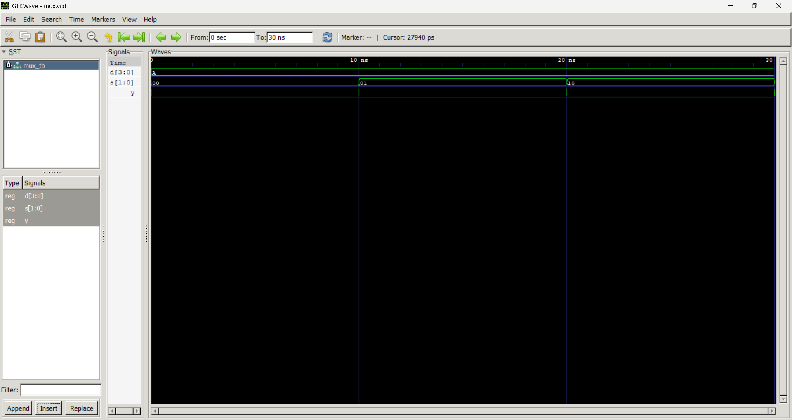
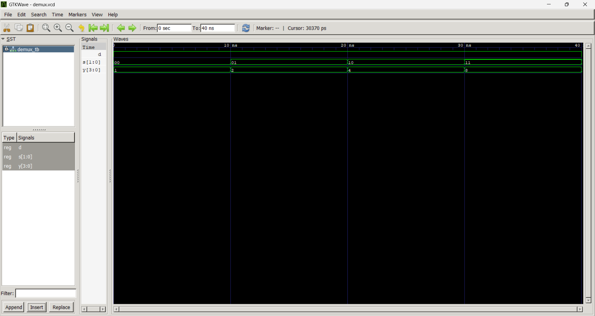

# Lab 4: VHDL Code for Combinational Circuits (MUX and DEMUX)

## Objective
- To design and simulate a 4-to-1 Multiplexer (MUX) in VHDL.  
- To design and simulate a 1-to-4 Demultiplexer (DEMUX) in VHDL.  

---

## Theory

### Multiplexer (MUX)
A multiplexer selects one of \(2^n\) input data lines and routes it to a single output based on \(n\) select lines.  
A 4-to-1 MUX has 4 data inputs (D0–D3), 2 select lines (S1S0), and 1 output (Y).

| S1 | S0 | Y   |
|----|----|-----|
| 0  | 0  | D0  |
| 0  | 1  | D1  |
| 1  | 0  | D2  |
| 1  | 1  | D3  |

---

### Demultiplexer (DEMUX)
A demultiplexer routes a single input to one of \(2^n\) output lines based on \(n\) select lines.  
A 1-to-4 DEMUX has 1 data input (D), 2 select lines (S1S0), and 4 outputs (Y0–Y3).

| S1 | S0 | Active Output |
|----|----|---------------|
| 0  | 0  | Y0 = D        |
| 0  | 1  | Y1 = D        |
| 1  | 0  | Y2 = D        |
| 1  | 1  | Y3 = D        |

---
## Output

**Multiplexer**

**Demultiplexer**

## Discussion
- The **multiplexer (MUX)** acts as a data selector, allowing multiple inputs to share a single output line. This is highly useful in digital systems where efficient routing of signals is required.  
- The **demultiplexer (DEMUX)** performs the opposite function, distributing a single input to multiple outputs. This is essential in applications such as memory addressing, where one signal must activate a specific line.  
- Simulation results confirmed that the MUX correctly routed the selected input to the output based on the select lines, and the DEMUX correctly activated only the designated output line while keeping others low.  
- Together, MUX and DEMUX demonstrate complementary roles in digital design: one compresses multiple signals into one line, while the other expands one signal into multiple lines.

---

## Conclusion
- Successfully designed and simulated a **4-to-1 multiplexer** and a **1-to-4 demultiplexer** using VHDL.  
- Verified correct operation through truth tables and simulation waveforms.  
- Learned how **MUX enables efficient signal selection** and how **DEMUX enables signal distribution**, both of which are fundamental building blocks in digital circuit design.  
