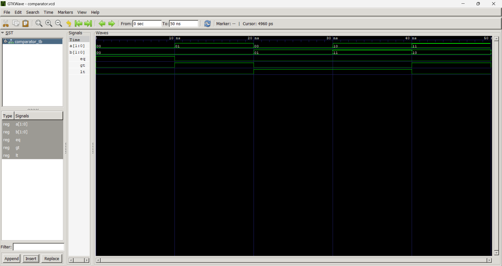

# Lab 5: VHDL Code for Combinational Circuits – Magnitude Comparator

## Objective
- To design and simulate a 2-bit magnitude comparator using VHDL.  
- To understand how hardware comparison operations are implemented using logic gates and concurrent statements.

---

## Theory
A magnitude comparator is a combinational circuit that compares two binary numbers, **A** and **B**, to determine their relative magnitude. It generates three distinct binary outputs: **EQ** (Equal), **GT** (Greater Than), and **LT** (Less Than).

For a 2-bit comparator, the inputs are defined as:

$A = A_1A_0, \quad B = B_1B_0$

The Boolean equations governing the outputs are:

- **Equal (EQ):**

$EQ = \overline{A_1 \oplus B_1} \cdot \overline{A_0 \oplus B_0}$

- **Greater Than (GT):**

$GT = A_1\overline{B_1} + (A_1 \odot B_1) \cdot A_0\overline{B_0}$

- **Less Than (LT):**

$LT = \overline{A_1}B_1 + (A_1 \odot B_1) \cdot \overline{A_0}B_0$

---

## Output

---

## Discussion
- The comparator ensures **mutually exclusive outputs**: only one of EQ, GT, or LT is active at a time.  
- The design evaluates the **Most Significant Bits (MSBs)** first. If $A_1 \neq B_1$, the result is determined immediately without considering the LSBs.  
- The **Least Significant Bits (LSBs)** are only factored into the GT and LT expressions when the MSBs are equal.  
- This cascading dependency mirrors hierarchical comparison logic used in larger digital systems.  
- In VHDL, concurrent signal assignments map directly onto FPGA Look-Up Tables (LUTs), ensuring efficient synthesis and minimal propagation delay.  
- Simulation confirms that for any input pair ($A_1A_0$, $B_1B_0$), exactly one output is HIGH, validating the correctness of the design.

---

## Conclusion
- A 2-bit magnitude comparator was successfully designed and simulated in VHDL.  
- The comparator correctly identifies equality, greater-than, and less-than conditions.  
- The truth table and simulation results matched the theoretical Boolean expressions.  
- This experiment demonstrated the direct relationship between Boolean algebra and hardware implementation.  
- The design principles here can be extended to **N-bit comparators**, either through behavioral modeling (`if-else` or `when-else`) or by cascading smaller comparators structurally.
